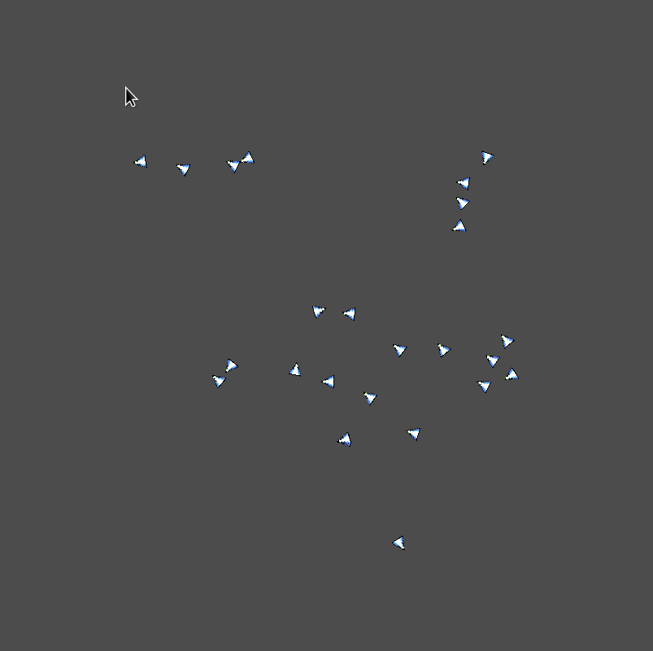
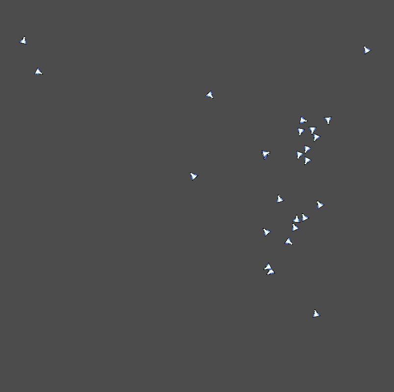

# Godot Boids

## Overview

This is small implementation of Boids in Godot!
Not finished yet, check back soon!

## Background

### What are Boids?
Boids are a type of simulated life model originally developed in the late 80s by Craig Reynolds. 
Using three basic principles of **Separation**, **Alignment**, and **Cohesion**, Boids are able to convincingly 
simulate the flocking behavior of birds and other animals. It's an interesting emergent property
that I think is worth investigating!

### Resources
Read more about them [here](https://cs.stanford.edu/people/eroberts/courses/soco/projects/2008-09/modeling-natural-systems/boids.html)!
The Stanford web page provides an excellent overview, and contains links to pseudo code and the original paper published
by Reynolds in *Computer Graphics*. 
There's also a [really excellent video by Sebastian Lague](https://www.youtube.com/watch?v=bqtqltqcQhw) if you're interested.

## Development Log

### Diary

#### 23/03/05

Day 1 of this little excursion!
I tried to implement smooth velocities and turn rates from the get go and it turned out extremely jank. When they weren't flying all over the place at top speeds, they completely ignored collisions and flew steadfastly off into the sunset together like lemmings.

Eventually, I gave up and used the [peudo code](https://vergenet.net/~conrad/boids/pseudocode.html).
It turned out much nicer. It was initially very janky, but after making some minor adjustments 
I was able to get the smooth motion I wanted

I think the required thought process for projects like this should be like making a sculpture.
Start from the general and simple, get the rough outline, then refine.
The pseudo has *very* simple rules for the boid motion, I was incredibly surprised.
I had to do some refinements and tweak the parameters a bit (and I definitely will do some more of that),
but it turned out nice. 

I think, next I'd like to create a UI to manage the boid parameters and the viewing window.

### Immediate Goals

--Basic neighbor detection and flight path adjustment.--
--(Literally just boids)--

### Future Goals

- UI to control boid parameters.
- Environmental goals and obstacles
- Vision cone visualization
- Nearest neighbors visualization
- Flight trails
- Translate from GodotScript to C++ or Rust using GDNative. 
- Possible short game implementation!
  - Different flocks? (birds)
  - Cooler Sprites?

